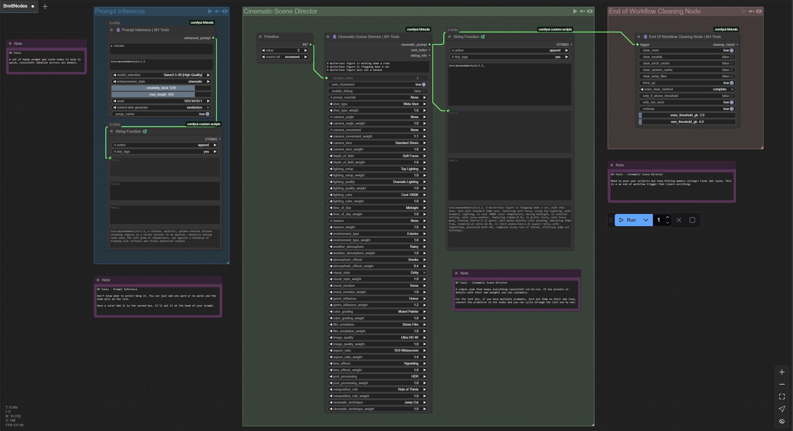

# 🎬 BH Tools for ComfyUI

A suite of creative tools designed to help AI artists with continuity, brainstorming, and workflow optimization. Born from real-world needs during my AI journey, these nodes solve common pain points in creative workflows.

> **⚠️ Beta Release**: All nodes are currently in beta. Expect updates and improvements!

## 🚀 What's Included

### 🎭 Cinematic Scene Director
The ultimate prompt engineering powerhouse for creating sophisticated cinematic scenes. This node cycles through master prompts and applies comprehensive cinematic parameters.

**Key Features:**
- Auto-incrementing master prompt system
- 40+ cinematic parameters with weight controls
- Professional film terminology and techniques
- Preset overrides for quick styling
- Debug mode for fine-tuning

**Perfect for:**
- Film-style renders
- Consistent scene generation
- Professional photography looks
- Rapid prototyping of visual concepts

### 🧠 Prompt Inference Engine
Local LLM-powered prompt enhancement that takes your basic ideas and transforms them into detailed, professional prompts while keeping your original intent intact.

**Key Features:**
- Multiple model support (Qwen, Llama)
- Custom trigger word integration
- Style-based enhancement (photography, artistic, cinematic, realistic)
- Fallback enhancement when models aren't available
- Creativity level controls

**Perfect for:**
- Upgrading simple prompts
- Maintaining prompt consistency
- Adding professional photography terms
- Brainstorming variations

### 🧹 End of Workflow Cleanup
Because nobody likes memory leaks! This node handles all the cleanup tasks at the end of your workflow, keeping your system running smoothly.

**Key Features:**
- Smart VRAM and RAM management
- Model unloading
- Temp file cleanup
- Conditional execution based on memory thresholds
- Detailed cleanup reports

**Perfect for:**
- Long rendering sessions
- Memory-intensive workflows
- Preventing system crashes
- Maintaining performance

## 📸 Workflow Example



*Example workflow showing all three nodes working together*

## 🎯 Quick Start Examples

### Cinematic Scene Director
```
Master Prompts:
A lone figure walking through rain-soaked streets
A majestic castle on a hilltop at sunset
An intimate conversation in a dimly lit café

Settings:
- Shot Type: Medium Close-Up (1.2)
- Lighting: Rembrandt Lighting (1.3)
- Mood: Melancholic (1.1)
- Color Grading: Teal and Orange (0.9)
```

**Output:** "A lone figure walking through rain-soaked streets, (medium close-up:1.2) shot, using (rembrandt lighting:1.3), with (melancholic:1.1) mood, with (teal and orange:0.9) color grading."

### Prompt Inference Engine
```
Input: "A man in a monkey outfit"
Trigger Words: "lora:characterLora:0.8"
Style: Photography
Creativity: 0.8
```

**Output:** "lora:characterLora:0.8, A man in a monkey outfit, professional photography, high resolution, detailed, sharp focus, 8K resolution, professional lighting"

## 🛠️ Installation

1. Clone or download this repository to your ComfyUI custom nodes folder:
   ```
   ComfyUI/custom_nodes/comfyui-bh-tools/
   ```

2. Install dependencies:
   ```bash
   pip install torch transformers psutil
   ```

3. Restart ComfyUI

4. Look for the "🎬 BH Tools" category in your node menu

## 💡 Pro Tips

- **Use Cinematic Scene Director for consistency**: Set up your master prompts once and let the node cycle through them automatically
- **Combine with Prompt Inference**: Use the Cinematic Director output as input for Prompt Inference for double-enhanced results
- **Memory management**: Always end your workflows with the Cleanup node, especially for long sessions
- **Weight experimentation**: Try different weight values (0.8-1.2) to find your sweet spot
- **Preset exploration**: The Cinematic Director has tons of presets - try "Epic Cinematic" or "Noir Shadows" for dramatic effects

## 🔧 Technical Notes

- **Model Support**: Prompt Inference supports local models via HuggingFace transformers
- **Memory Requirements**: Models require 2-8GB VRAM depending on size chosen
- **Fallback Mode**: All nodes gracefully degrade when resources aren't available
- **Platform Support**: Tested on Windows and Linux

## 🐛 Known Issues (Beta)

- Some model loading might be slow on first run
- Cleanup node may need adjustment for different GPU configurations
- Debug output can be verbose (easily toggled off)

## 🤝 Contributing

Found a bug? Have a feature request? These tools are built for the community, so feedback is always welcome!

## 📜 License

MIT License - Use these tools however helps your creative process!

---

*Built with ❤️ for the AI art community. Happy creating!*